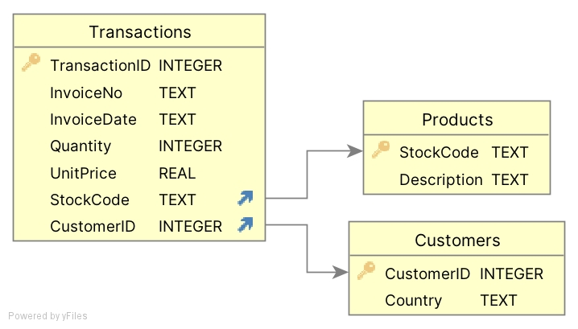

# MLOps Lecture 1 - Intro to APIs & DataBases

This repository contains lecutre slides, python scripts and dataset for the first lecture. 

## API
- file 

## Database

  

- **db_create.py** reads in excel file and transform it into SQL database
- **db_queries.py** contains a few query examples
- **db_add_datapoints** add new transactions
- **db_add_columns** add new columns
- **data/Online Retail.xlsx** is dataset used to create database (https://archive.ics.uci.edu/dataset/352/online+retail)
